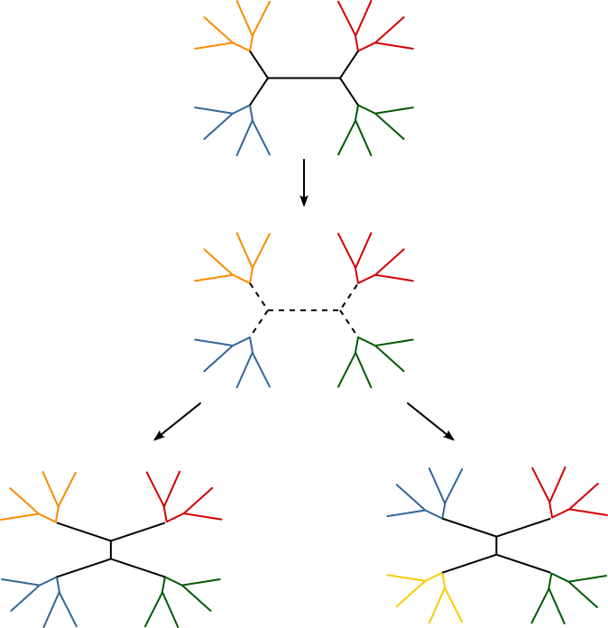
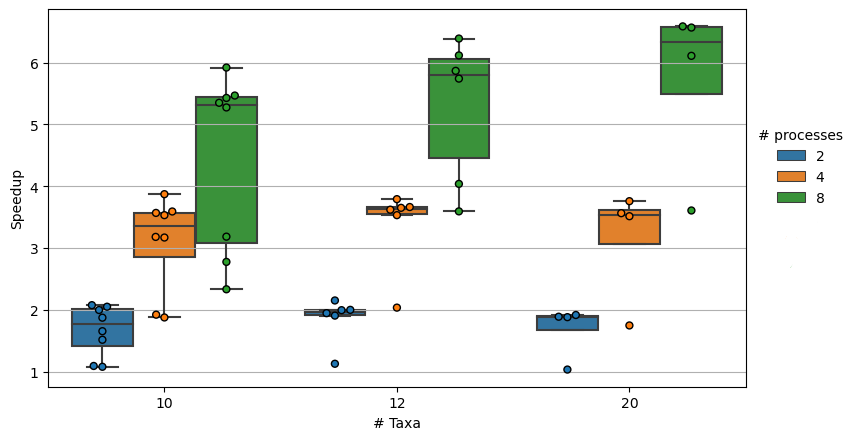

# Abstract
I want to parallelize phylogenetic tree search under nonhomogeneous substitution models. Implementing maximum likelihood tree search for this problem, even with one of the phylogenetics libraries like lbpll or Bio++ would still take a significant amount of time, especially for a problem that I'm not sure the outcome of. There's already software, e.g. PAML, that does nonhomogeneous maximum likelihood estimation, but only under fixed tree topologies. So instead I wrote a wrapper to use PAML to evaluate the likelihood of a tree topology, and evaluate neighboring tree topologies to do hill-climbing. The way I am trying to make this faster is to evaluate the likelihood of multiple trees at the same time. 

# Introduction
Maximum likelihood estimation of phylogenetic trees is a known NP-hard problem. The search space for just unrooted tree topologies is $(2n-5)!!$. A substitution model, which is a way of representing the rate at which substitutions on a sequence occur, is used for the likelihood calculation for this problem. Everything becomes harder when dealing with what are called nonhomogeneous substitution models, where the parameters for these models can change across lineages. For my research, I have been investigating the effect of lineage-specific variation on these inference problems. There are three programs/software packages I could find that support these kinds of nonhomogeneous models: PAML[2], BppML[3], and NHML[1]. PAML and BppML only support fixed-tree topology estimation under these models, and I could not get NHML to compile, so I don't know of its capability. So unfortunately, there really isn't a good head-to-head comparison. If I compared it against a standard model like that implemented in RAxML[4] or IQ-Tree, those would probably find a good tree topology before a nonhomogeneous model could calculate the best likelihood for one topology under a single-shift model.

There are many ways to parallelize phylogenetic tree search under maximum likelihood. The authors of RAxML have explored nearly all of them (vector instructions, OpenMP, MPI, threading, etc), but the general idea falls into two categories: parallelize calculations done on input sequences and parallelize the tree scoring. The former would require that I modify the likelihood calculation, and would have limited performance benefit for short multiple sequence alignments. I opted for the latter, in part because I would not want to mess around with the likelihood calculation, and in part because someone [already tried putting OpenMP for loops in PAML](https://github.com/zamaudio/paml-openmp) and, to quote their github: "Actually slows it down... useless!".

Since there aren't any existing programs that do tree search with nonhomogeneous models that I could find or get working, I am comparing against the serial implementation of this program I wrote before this project. 

**Figure 1.** I use the nearest-neighbors interchange to generate neighborhoods, as pictured above. For every internal edge (i.e. having 2 children on each side), you can get two NNI neighbors.

My implementation is as follows:
1. Generate a starting tree topology using a neighbor-joining algorithm using the hamming distances
2. Generate the NNI neighborhood for that tree topology
3. Distribute the trees to all the processes
4. Have every process run baseml on their subset of trees.  
    4.1 For each tree, try every possible assignment of a model shift on a single edge
5. Once a processes has finished evaluating all its assigned trees, report back the tree with the highest likelihood.
6. Have the rank 0 process gather the best trees each process came up with and determine which one has the greatest likelihood
7. If the best tree topology hasn't changed in this iteration, stop. Otherwise, generate the NNI-neighborhood for that best tree, exclude any tree topologies which were already visited, and repeat steps 3-7.
8. Report the best tree topology and shift assignment.

# Results
I generated multiple sequence alignments using INDELible to test the program under a bunch of model conditions. Synthetic data is good enough for just testing speed, and good empirical datasets can be hard to find and require a bunch of work. 

  
**Figure  2:** Speedup using 2,4, and 8 processes on a single machine. Since the times vary greatly depending on the difficulty of the problem, I opted to compare the speedup. Speedup is calculated as walltime of serial program divided by walltime of parallel program. 8 replicates for 10 taxa, 6 replicates for 12, and 4 for 20 taxa, mostly due to time constraints. 

It looks as though I am getting speedup, roughly 2x with 2 processes, 3.5x with 4 processes, and ~6x with 8 processes.

# Discussion

Overall, I would consider this a success. More processes lead to speedup, with 2 processes often nearing perfect scaling. With 8 processes however, the best scaling was roughly 6.5x. In some of the worst cases, the speedup was negligible. There are a couple reasons this may happen. For one, some tree topologies are more challenging to optimize for the given data. There isn't an easy way to tell which ones will take longer without trying to do it in the first place. 

There's also some level of synchronization going on between these processes, as every process has to finish their chunk of the neighborhood before the next neighborhood is calculated and distributed. If I had enough time, I would implement a dynamic load balancing approach, where the main process distributes work to processes which are already done with their bit, instead of having to wait for all other processes before getting the next neighborhood.

This probably doesnt have much of an affect in this case, but the initial tree is found using a serial method implemented in BioPython. The main problem with this method is for $n$ taxa, you have $O(n^2)$ distances to compute, so this could potentially be very slow for larger trees, or longer alignments. I was going to implement a random initialization for the first step, but I encountered an issue where the way I was generating random trees actually produced very similar  topologies. This made the first iteration basically serial, and it usually took no more than 3 iterations to complete so that killed performance.

Lastly, the choice of nearest-neighbor interchanges for tree rearrangment was mostly out of simplicity. While NNI is $O(n)$, there are other methods which produce larger neighborhoods, but as a result have increased time complexity $O(n^2)$ to $O(n^3)$. However, they have the benefit of not requiring as many iterations, and exploring more of the search space, as well as being less likely to get trapped in local minima. Most importantly, they are not that difficult to parallelize. The subtrees to perform these rearrangement operations on can be divided amongst the processes, and they can then work on those neighboring trees they generated. This has the benefit of not needing to send a ton of trees via MPI, but instead 1 tree and a way to tell what subset of work to do. 

# References

[1] N. Galtier and M. Gouy, “Inferring pattern and process: maximum-likelihood implementation of a nonhomogeneous model of DNA sequence evolution for phylogenetic analysis.,” Molecular Biology and Evolution, vol. 15, no. 7, pp. 871–879, Jul. 1998, doi: 10.1093/oxfordjournals.molbev.a025991.  
[2] J. Dutheil and B. Boussau, “Non-homogeneous models of sequence evolution in the Bio++ suite of libraries and programs,” BMC Evolutionary Biology, vol. 8, no. 1, p. 255, Sep. 2008, doi: 10.1186/1471-2148-8-255.  
[3] Z. Yang, “PAML 4: Phylogenetic Analysis by Maximum Likelihood,” Molecular Biology and Evolution, vol. 24, no. 8, pp. 1586–1591, Aug. 2007, doi: 10.1093/molbev/msm088.  
[4] A. Stamatakis, “RAxML version 8: a tool for phylogenetic analysis and post-analysis of large phylogenies,” Bioinformatics, vol. 30, no. 9, pp. 1312–1313, May 2014, doi: 10.1093/bioinformatics/btu033.
